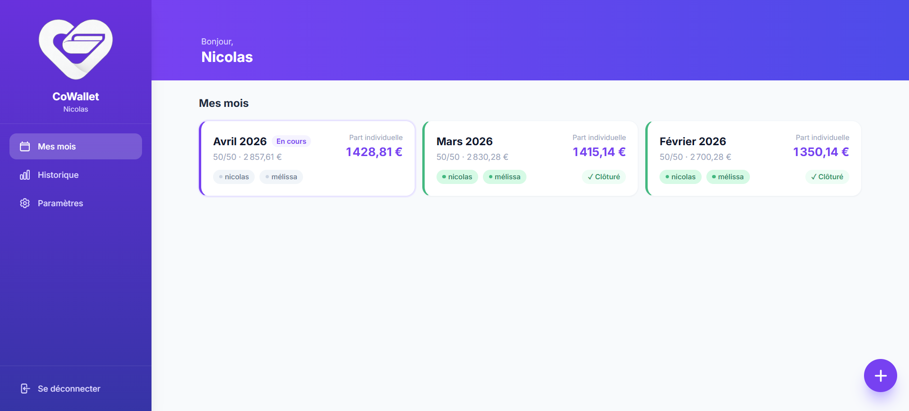
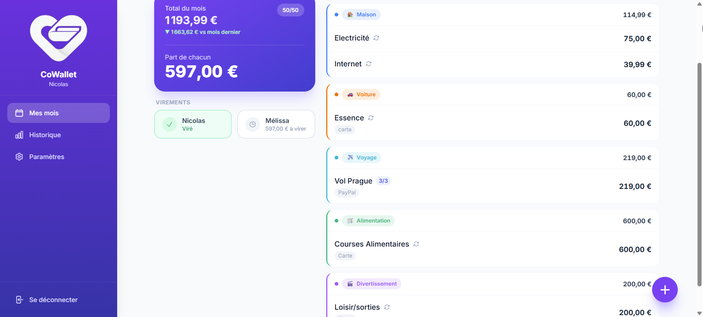
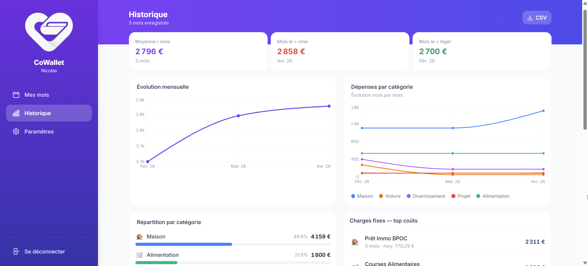

# CoWallet

<p align="center">
  
</p>

A mobile-first PWA for couples to manage their shared budget. Track monthly expenses, split costs automatically, plan ahead with recurring charges — and keep an eye on spending trends over time.

## Features

- **Monthly tracking** — create a month, add charges, mark transfers as done
- **Configurable split** — 50/50, 60/40, or any ratio you want
- **Recurring charges** — automatically copied to the next month
- **Installment payments** — split a purchase over N months, auto-carried forward
- **Charge suggestions** — autocomplete based on past entries
- **Custom categories** — create categories with icon and color
- **Custom payment methods** — add your own payment methods
- **History & charts** — monthly evolution, breakdown by category, top recurring costs
- **CSV export** — keep a backup of all your data
- **First-run setup** — no config file needed, just open the app
- **PWA** — installable on iOS and Android home screen
- **Rate-limited login** — brute-force protection on the auth endpoint

## Screenshots

<p align="center">
  
  
  
</p>

## Quick Start

### 1. Create a `docker-compose.yml`

```yaml
services:
  cowallet-frontend:
    image: ghcr.io/ninidas/cowallet-frontend:latest
    container_name: cowallet-frontend
    restart: unless-stopped
    # ports:
    #   - "3000:80"  # Uncomment to expose directly
    depends_on:
      - cowallet-backend

  cowallet-backend:
    image: ghcr.io/ninidas/cowallet-backend:latest
    container_name: cowallet-backend
    restart: unless-stopped
    volumes:
      - ./data:/data
```

### 2. Start with Docker Compose

```bash
docker compose up -d
```

The frontend is available on port 80 of the `cowallet-frontend` container. Expose it via your reverse proxy (Traefik, nginx, Caddy…) or uncomment the `ports` section.

### 3. First run

Open the app in your browser — you'll be guided through a setup wizard to create two user accounts and configure the default split ratio.

## Configuration

| Variable | Required | Description |
|----------|----------|-------------|
| `SECRET_KEY` | ❌ | JWT signing key — auto-generated and persisted on first run if not set |

## Tech Stack

- **Frontend** — React, Vite, Tailwind CSS, Recharts, PWA
- **Backend** — FastAPI, SQLAlchemy, SQLite
- **Auth** — JWT (python-jose), bcrypt
- **Proxy** — nginx

## License

AGPL-3.0 — see [LICENSE](LICENSE)
